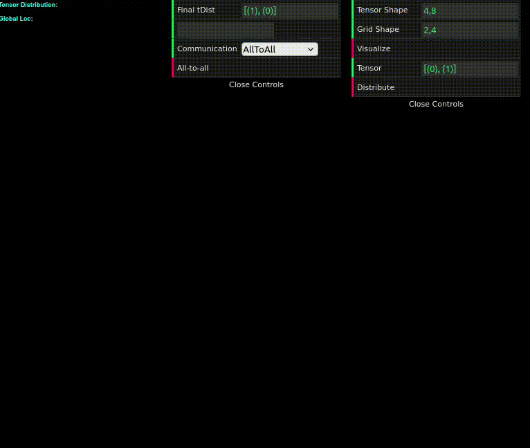

# ROTE collective communication visualizer

This javascript package visualizes data movement of collective communication patterns frequently leveraged for high-performance dense tensor computations on distributed-memory parallel computing systems.

The computing mesh and tensor data size can be selected with the drop-down menu.  Using the notation developed for the ROTE library, data is distributed among process ranks.  Once specified fully, the desired collective communication pattern can be selected and the redistribution visualized.

Currently, data movement behaves as if a fully-connected network topology underscored the computing mesh, hence only the initial and final data distributions should be looked to for an accurate representation of the machine state.  Still, we hope this helps in learning more about data distributions and redistributions occurring in scientific computing applications.

## Installation
The project is intended to be used as a Javascript web application.  Simple instructions to set up a local server on a Unix machine involves:
1. Downloading the source and placing it in your `/var/www/rote_visualizer` directory
2. Installing required packages with `npm install --save`
3. Starting the webserver with `npx vite --host`

## References
1. M. D. Schatz, R. A. van de Geijn, and J. Poulson. "Parallel Matrix Multiplication: A Systematic Journey". In: *SIAM Journal on Scientific Computing* 38.6 (2016), pp. C748-C479. DOI: [10.1137/130907215](https://epubs.siam.org/doi/10.1137/140993478)
2. M. D. Schatz. "Anatomy of Parallel Computations with Tensors". PhD thesis. The University of Texas at Austin, Sept. 2015.
3. [ROTE tensor library](https://github.com/mdschatz/rote)
